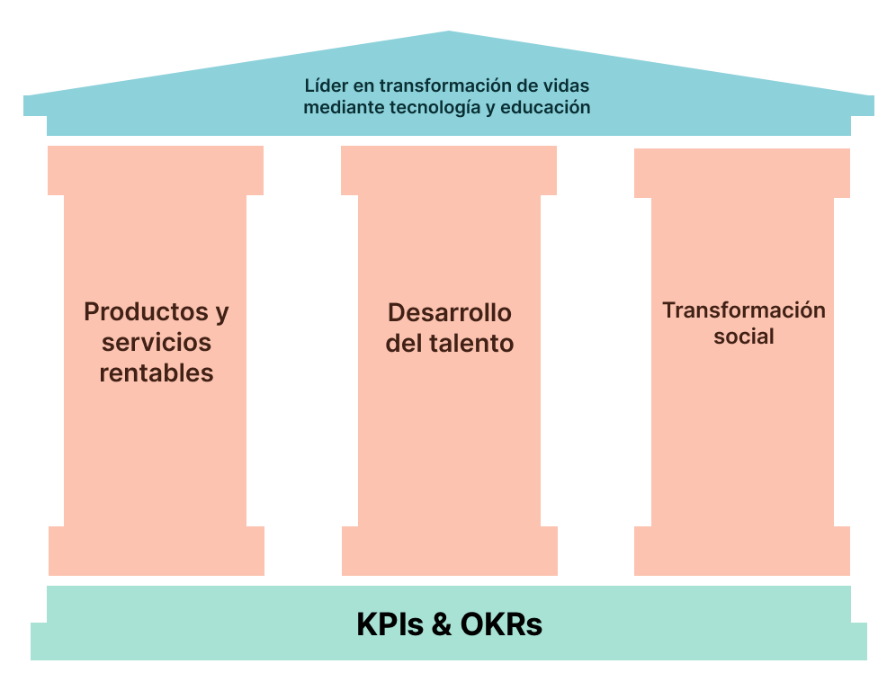

import Admonition from '@theme/Admonition';

# Pilares estratégicos

Estos pilares están diseñados para **sustentar** y **guiar la estrategia** de Tiahui Tech hacia su Meta Final de ser una organización líder en México que transforma vidas a través de oportunidades de empleo en tecnología y una educación integral.



## Productos y servicios rentables

<Admonition type="info" icon=" " title=" ">
  <p>Desarrollar productos de software y servicios de consultoría innovadores y de alta calidad que generen ingresos significativos y sostenibles para la organización.</p>
  <ul>
    <li>Crear soluciones tecnológicas únicas y valiosas que satisfagan las necesidades del mercado y los clientes.</li>
    <li>Ofrecer servicios de consultoría especializados y efectivos que aporten un alto valor a los clientes.</li>
    <li>Optimizar continuamente los productos y servicios para maximizar su rentabilidad y escalabilidad.</li>
  </ul>
</Admonition>

## Desarrollo del talento

<Admonition type="note" icon=" " title=" ">
  <p>Cultivar un entorno que potencie el crecimiento, el aprendizaje y el éxito de los miembros del equipo y de los estudiantes de la escuela de programación.</p>
  <ul>
    <li>Implementar programas de capacitación integral que abarquen habilidades técnicas, profesionales y de vida.</li>
    <li>Establecer un sistema de mentoría para guiar y apoyar el desarrollo de los miembros y estudiantes.</li>
    <li>Fomentar oportunidades de liderazgo y toma de decisiones para los miembros del equipo.</li>
  </ul>
</Admonition>

## Impacto social y bienestar holístico

<Admonition type="success" icon=" " title=" ">
  <p>Generar un impacto positivo y duradero en las vidas de los miembros, estudiantes y comunidades a través de iniciativas que promuevan el bienestar holístico y el desarrollo socioeconómico.</p>
  <ul>
    <li>Implementar programas y recursos que apoyen el bienestar físico, mental, emocional y financiero de los miembros del equipo y estudiantes.</li>
    <li>Colaborar con organizaciones y líderes comunitarios para identificar y abordar desafíos locales a través de la tecnología y la educación.</li>
    <li>Medir y comunicar el impacto social de las iniciativas de Tiahui Tech para inspirar a otros y atraer apoyo y colaboración.</li>
  </ul>
</Admonition>


## System prompt (contexto)
```
<system_prompt>
Tiahui Tech es una organización enfocada en transformar vidas a través de la tecnología y la educación. Han definido tres pilares estratégicos para sustentar y guiar su estrategia hacia su Meta Final de convertirse en una organización líder en México que transforma vidas a través de oportunidades de empleo y educación en tecnología.
Los tres pilares estratégicos son:

Productos y servicios rentables

Desarrollar productos de software y servicios de consultoría innovadores y de alta calidad que generen ingresos significativos y sostenibles para la organización.
Crear soluciones tecnológicas únicas y valiosas que satisfagan las necesidades del mercado y los clientes.
Ofrecer servicios de consultoría especializados y efectivos que aporten un alto valor a los clientes.
Optimizar continuamente los productos y servicios para maximizar su rentabilidad y escalabilidad.


Desarrollo del talento

Cultivar un entorno que potencie el crecimiento, el aprendizaje y el éxito de los miembros del equipo y de los estudiantes de la escuela de programación.
Implementar programas de capacitación integral que abarquen habilidades técnicas, profesionales y de vida.
Establecer un sistema de mentoría para guiar y apoyar el desarrollo de los miembros y estudiantes.
Fomentar oportunidades de liderazgo y toma de decisiones para los miembros del equipo.


Impacto social y bienestar holístico

Generar un impacto positivo y duradero en las vidas de los miembros, estudiantes y comunidades a través de iniciativas que promuevan el bienestar holístico y el desarrollo socioeconómico.
Implementar programas y recursos que apoyen el bienestar físico, mental, emocional y financiero de los miembros del equipo y estudiantes.
Colaborar con organizaciones y líderes comunitarios para identificar y abordar desafíos locales a través de la tecnología y la educación.
Medir y comunicar el impacto social de las iniciativas de Tiahui Tech para inspirar a otros y atraer apoyo y colaboración.
```